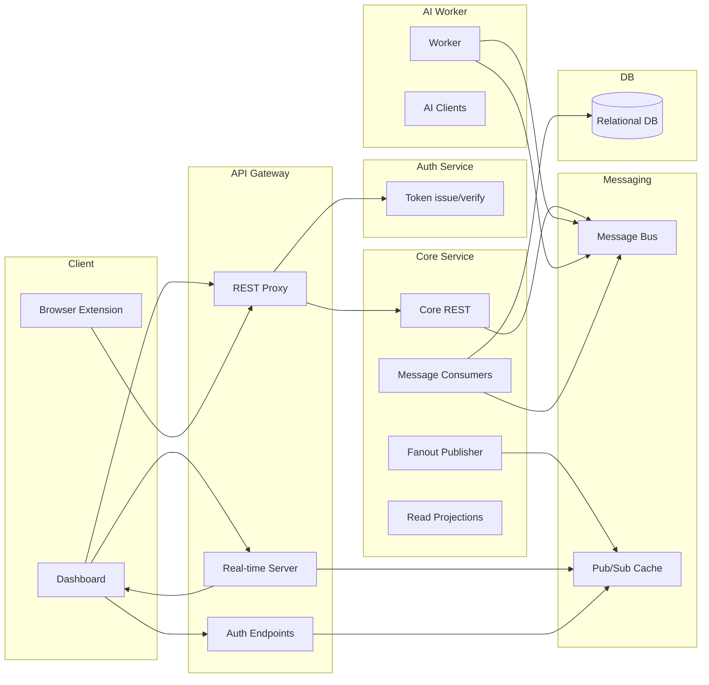

# SnippetQuiz

## Overview
SnippetQuiz turns web content into interactive quizzes. The system includes a web dashboard, a browser extension for capturing content, an API gateway, a core service that manages domain logic and persistence, and an AI worker that generates questions. Messaging coordinates generation events, a cache provides locks and pub/sub, and a real‑time channel streams progress to the UI. Data persists in a relational database, with read‑optimized projections.

## Architecture
- Frontend: Web dashboard that renders authenticated pages and subscribes to real‑time quiz generation progress.
- API Gateway: Authenticates requests, enforces rate limits, proxies traffic to the core service, and hosts the real‑time server.
- Auth Service: Issues and verifies tokens, manages refresh tokens, and exposes authentication endpoints.
- Core Service: Owns the domain and persistence, updates state in response to events, and publishes fanout updates for the UI.
- AI Worker: Listens to generation requests, chunks content, calls an AI, and publishes generated results as events.
- Browser Extension: Captures page text and transcripts and submits content to the system.
- Infra: Container orchestration and database setup.

## Architecture Diagram

## Core Flows
- Authentication
  - Dashboard uses secure cookies or headers for authenticated requests and may refresh tokens transparently.
  - Extension authenticates separately and can generate a one‑time code for seamless dashboard login.
- Content Capture
  - Extension submits content (full pages, selected text, transcripts) to organize within content banks.
- Generation
  - The UI requests a quiz for a bank. The gateway forwards this to the core service.
  - The AI worker consumes generation requests, chunks content, calls AI models, and emits generation progress and results as events.
  - The core service consumes generation events, persists questions, advances quiz status, and fanouts progress to the UI.
- Real‑time
  - The gateway’s real‑time server subscribes to fanout messages and streams progress/completion to the browser.

## Data Model (high level)
- Content Banks: User‑scoped containers grouping entries.
- Content Entries: Captured content (page, selection, or transcript) with metadata; may be enriched over time.
- Topics: Optional user‑specific tags that can be attached to entries.
- Questions/Options: Generated questions tied to content entries.
- Quiz: Aggregate with status transitions and current question.
- Event Store: Append‑only domain events for consistency.
- Projections: Read‑optimized views built from events and state changes.

## Gateway Proxying
- Authenticated requests are forwarded to the core service with user context.
- Errors propagate with HTTP status preservation.

## Real‑Time Updates
- Pub/sub carries progress and completion events.
- The real‑time server validates users and ensures a single active generation per user.

## Logic Summary
- Users create banks and add entries (from extension or dashboard).
- When a quiz is requested for a bank, content is chunked and sent to an LLM to generate questions.
- Generated questions are persisted and quiz status is advanced. Users see progress live via WebSockets and complete the quiz in the UI.