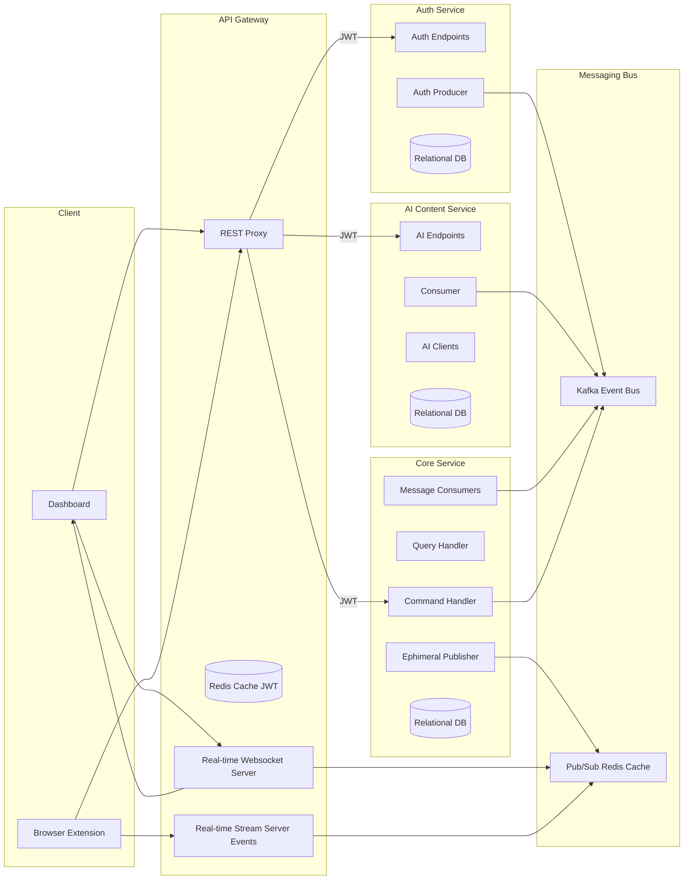
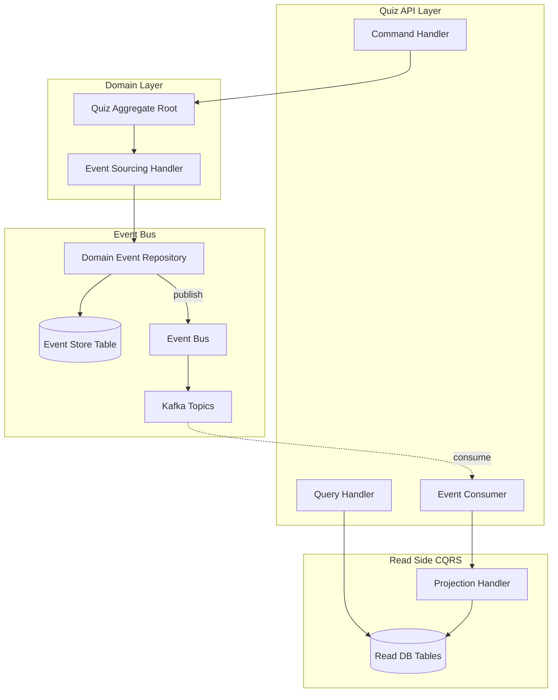
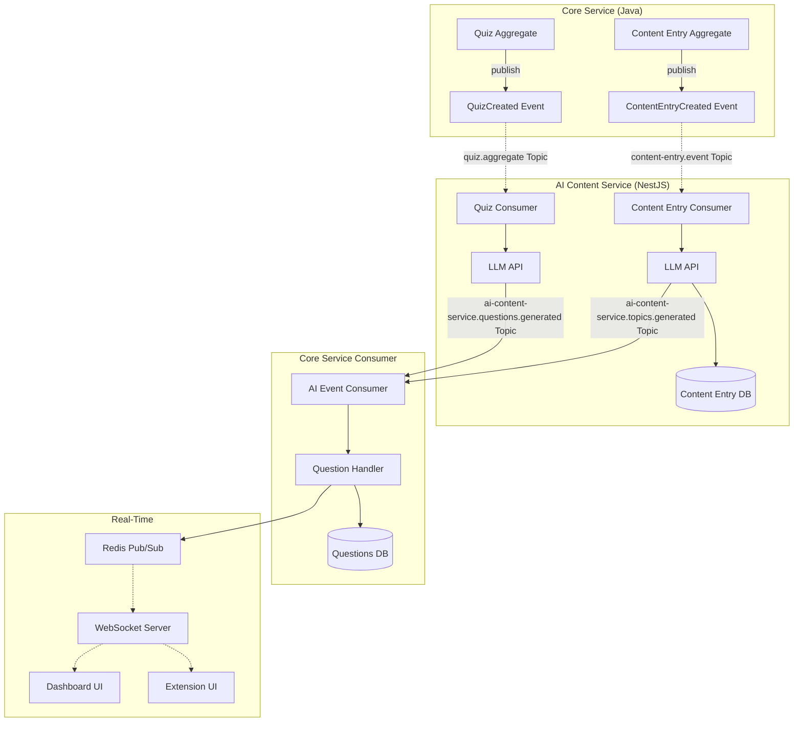

# SnippetQuiz

## Overview
SnippetQuiz turns web content into interactive quizzes. The system includes a web dashboard, a browser extension for capturing content, an API gateway, a core service that manages domain logic and persistence, and an AI content service that generates questions. Messaging coordinates generation events, a cache provides locks and pub/sub, and a real‑time channel streams progress to the UI. Data persists in a relational database, with read‑optimized projections.

## Architecture
- Frontend: Web dashboard that renders authenticated pages and subscribes to real‑time quiz generation progress.
- API Gateway: Authenticates requests, enforces rate limits, proxies traffic to the core service, and hosts the real‑time server.
- Auth Service: Issues and verifies tokens, manages refresh tokens, and exposes authentication endpoints.
- Core Service: Owns the domain and persistence, updates state in response to events, and publishes fanout updates for the UI.
- AI Content Service: Listens to generation requests, chunks content, calls an AI, and publishes generated results as events.
- Browser Extension: Captures page text and transcripts and submits content to the system.
- Infra: Container orchestration and database setup.

## Architecture Diagrams

### 1. System Context (High Level)
High-level overview of system components and their interactions.



### 2. Core Service: Event Sourcing & CQRS
Internal architecture of the Core Service, showing how events are persisted and consumed to build projections.



### 3. AI Generation Workflow
Asynchronous flow for generating questions and topics using the AI Processor.



## Core Flows
- Authentication
  - Dashboard uses secure cookies or headers for authenticated requests and may refresh tokens transparently.
  - Extension authenticates separately and can generate a one‑time code for seamless dashboard login.
- Content Capture
  - Extension submits content (full pages, selected text, transcripts) to organize within content banks.
  - **Character Animation**: Upon upload, the system analyzes the content to generate topics and a character reaction. This reaction is streamed back to the extension/dashboard in real-time, displaying an animated character with a comment.
- Generation
  - The UI requests a quiz for a bank. The gateway forwards this to the core service.
  - The AI content service consumes generation requests, chunks content, calls AI models, and emits generation progress and results as events.
  - The core service consumes generation events, persists questions, advances quiz status, and fanouts progress to the UI.
- Real‑time
  - The gateway's real‑time server subscribes to fanout messages and streams progress/completion to the browser.

## Data Model (high level)
- Content Banks: User‑scoped containers grouping entries.
- Content Entries: Captured content (page, selection, or transcript) with metadata; may be enriched over time.
- Topics: Optional user‑specific tags that can be attached to entries.
- Questions/Options: Generated questions tied to content entries.
- Event Store: Append‑only Quiz Event Store for consistency.
- Projections: Read‑optimized views built from events and state changes.

## Gateway Proxying
- Authenticated requests are forwarded to the core service with user context.
- Errors propagate with HTTP status preservation.

## Real‑Time Updates
- Pub/sub carries progress and completion events.
- The real‑time server validates users and ensures a single active generation per user.
- **Character Events**: Ephemeral events carrying character animation data are broadcasted via Redis and streamed to connected clients (Extension/Dashboard) for immediate visual feedback.

## Logic Summary
- Users create banks and add entries (from extension or dashboard).
- When a quiz is requested for a bank, content is chunked and sent to the LLM to generate questions.
- Generated questions are persisted and quiz status is advanced. Users see progress live via WebSockets and complete the quiz in the UI.

## Homelab Deployment Architecture

The system is designed to be deployed in a Kubernetes homelab environment using a **GitOps** approach governed by **Flux CD**. The entire cluster state—including infrastructure, controllers, and applications—is defined declaratively in the `deploy` directory.

### 1. Infrastructure Stack
The platform relies on robust cloud-native operators and controllers:

- **Traefik**: Serves as the Ingress Controller and API Gateway, managing external access, routing, and SSL termination.
- **CloudNativePG**: The PostgreSQL Operator responsible for provisioning and managing high-availability database clusters for the Core, Auth, and AI services.
- **Strimzi**: The Kafka Operator that manages the Kafka brokers and topics, powering the event-driven architecture.
- **Redis**: Deployed for caching, token storage, and real-time pub/sub messaging.
- **Cert-Manager**: Automates the management and issuance of TLS certificates.

### 2. GitOps & Secrets (Flux CD)
- **Synchronization**: Flux CD monitors the repository and automatically applies changes from the `deploy` directory to the cluster.
- **Structure**:
    - `deploy/charts`: Local Helm charts.
    - `deploy/apps`: Kustomizations for applications.
    - `deploy/clusters`: Cluster-specific configurations (e.g., `homelab`).
- **Secret Management**:
    - **SOPS**: Secrets (like `common-env`) are encrypted using [Mozilla SOPS](https://github.com/getsops/sops) and committed to the repository. Flux decrypts them at runtime using configured keys (e.g., AGE keys).

### 3. CI/CD Pipeline
The project uses limited-scope GitHub Actions for integration and packaging, while Flux handles deployment:
- **Continuous Integration (CI)**:
  - Validates code (Java/NestJS/Next.js) on Pull Requests.
  - Runs unit and integration tests.
- **Artifact Publishing**:
  - **Docker Images**: Built and pushed to the GitHub Container Registry (GHCR).
  - **Helm Charts**: Packaged as OCI artifacts and published to GHCR.
- **Continuous Deployment (CD)**:
  - Flux detects new Helm Chart versions or image tags (depending on policy) and reconciles the cluster state.

## Artifact Registry
You can download the container images and OCI Helm charts directly from the [GitHub Packages Registry](https://github.com/rafaesc?tab=packages&repo_name=snippetquiz).

### Docker Images
To pull the latest Docker images:
```bash
docker pull ghcr.io/rafaesc/snippetquiz/snippetquiz-api-gateway:latest
docker pull ghcr.io/rafaesc/snippetquiz/snippetquiz-core-service:latest
docker pull ghcr.io/rafaesc/snippetquiz/snippetquiz-auth-service:latest
docker pull ghcr.io/rafaesc/snippetquiz/snippetquiz-ai-content-service:latest
docker pull ghcr.io/rafaesc/snippetquiz/snippetquiz-frontend:latest
```

### OCI Helm Charts
To pull the Helm charts from the OCI registry:
```bash
# Example for Core Service Chart
helm pull oci://ghcr.io/rafaesc/charts/snippetquiz-core-service-chart --version <version>

# Example for Frontend Chart
helm pull oci://ghcr.io/rafaesc/charts/snippetquiz-frontend-chart --version <version>
```
